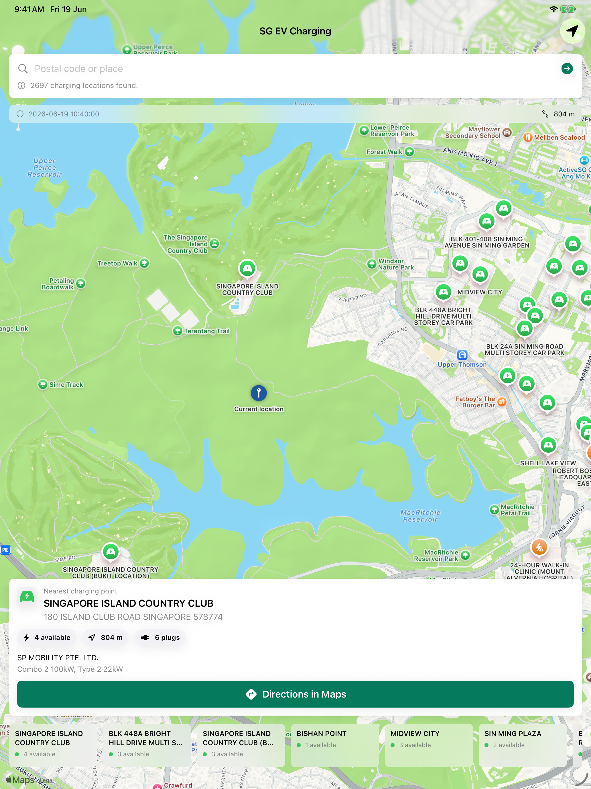

<div align="center">

# SG EV Charging

[](https://swift.org)
[](https://developer.apple.com/ios/)
[](https://developer.apple.com/xcode/swiftui/)
[](https://developer.apple.com/documentation/mapkit)
[](#license)

**Find nearby EV charging points in Singapore with live availability from LTA DataMall.**

[Report Bug](https://github.com/alfredang/sgevchargingapp/issues) · [Request Feature](https://github.com/alfredang/sgevchargingapp/issues)

</div>

## Screenshot



## About

SG EV Charging is a native SwiftUI iOS app for locating electric vehicle charging points around Singapore. It combines MapKit location search, current-location detection, and LTA DataMall EV charging data to show nearby stations, available plugs, operators, charging speeds, and directions in Apple Maps.

Key features:

- Search by Singapore postal code or place name.
- Detect the user's current location and rank charging points by distance.
- Display available, occupied, and unavailable connector states.
- Show operator, plug type, power rating, and last-updated metadata.
- Open turn-by-turn directions in Apple Maps.
- Present a map-first interface with nearby charging chips for quick station switching.

## Tech Stack

| Layer | Technology |
| --- | --- |
| App | Swift 5, SwiftUI |
| Maps & Location | MapKit, CoreLocation, CLGeocoder |
| Data | LTA DataMall EVChargingPoints and EVCBatch APIs |
| Project | Xcode project, XcodeGen `project.yml` |
| Platform | iOS 17+, iPhone and iPad |

## Architecture

```text
SG EV Charging
├── SwiftUI Views
│   ├── ContentView
│   ├── ChargingResultCard
│   └── MiniResultChip
├── State & Search
│   └── ChargingSearchViewModel
├── Location
│   ├── UserLocationProvider
│   └── LocationSearchService
├── Data Access
│   └── LTADataMallClient
└── Models
    ├── EVChargingLocation
    ├── ChargingPoint
    ├── PlugType
    └── EVConnector
```

## Project Structure

```text
.
├── SGEVCharging.xcodeproj
├── SGEVCharging
│   ├── SGEVChargingApp.swift
│   ├── ContentView.swift
│   ├── ChargingSearchViewModel.swift
│   ├── LTADataMallClient.swift
│   ├── LocationSearchService.swift
│   ├── UserLocationProvider.swift
│   ├── Models.swift
│   ├── Theme.swift
│   ├── Info.plist
│   └── Resources
├── Config.sample.xcconfig
├── ExportOptions.plist
├── project.yml
└── screenshot.png
```

## Getting Started

### Prerequisites

- macOS with Xcode 16 or newer.
- iOS 17+ simulator or device.
- LTA DataMall account key.
- Optional: XcodeGen if you want to regenerate the project from `project.yml`.

### Setup

1. Clone the repository:

   ```bash
   git clone https://github.com/alfredang/sgevchargingapp.git
   cd sgevchargingapp
   ```

2. Create local API configuration:

   ```bash
   cp Config.sample.xcconfig Config.xcconfig
   ```

3. Add your LTA DataMall key to `Config.xcconfig`:

   ```text
   LTA_DATAMALL_ACCOUNT_KEY = your_account_key_here
   ```

4. Open `SGEVCharging.xcodeproj` in Xcode.

5. Add `Config.xcconfig` to the app target's Debug and Release build configurations, or pass it to `xcodebuild` with `-xcconfig Config.xcconfig`.

6. Build and run the `SGEVCharging` scheme.

### Command Line Build

```bash
xcodebuild \
  -project SGEVCharging.xcodeproj \
  -scheme SGEVCharging \
  -destination 'platform=iOS Simulator,name=iPhone 17 Pro Max' \
  -xcconfig Config.xcconfig \
  build
```

## Data Source

The app uses Singapore Land Transport Authority DataMall APIs:

- `EVChargingPoints` for postal-code scoped charging data.
- `EVCBatch` for island-wide batch data.

API credentials are intentionally excluded from Git. `Config.xcconfig` is ignored by `.gitignore`; commit only `Config.sample.xcconfig`.

## Contributing

1. Fork the repository.
2. Create a feature branch.
3. Make a focused change with a clear commit message.
4. Open a pull request with screenshots for UI changes.

## License

No license has been specified yet.

## Developed By

Tertiary Infotech Academy Pte. Ltd.

